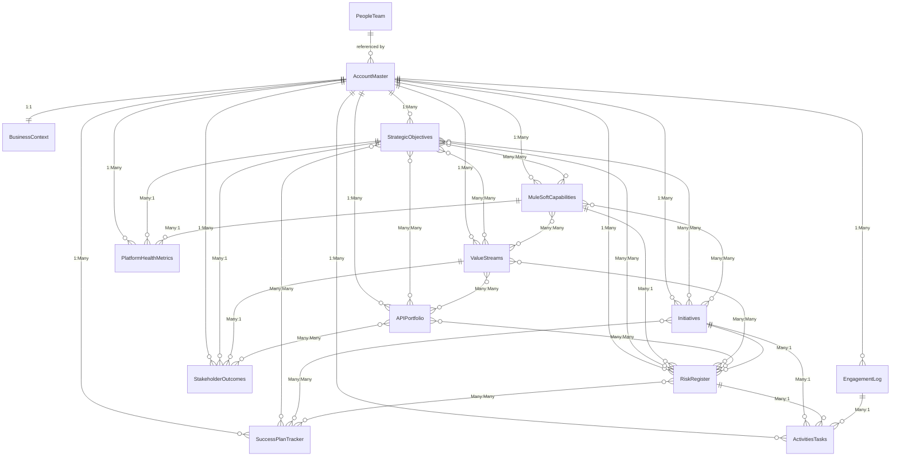
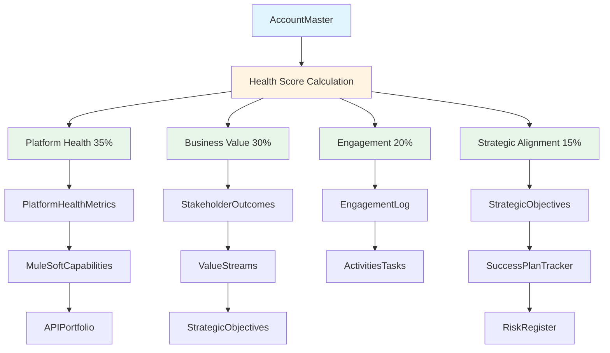
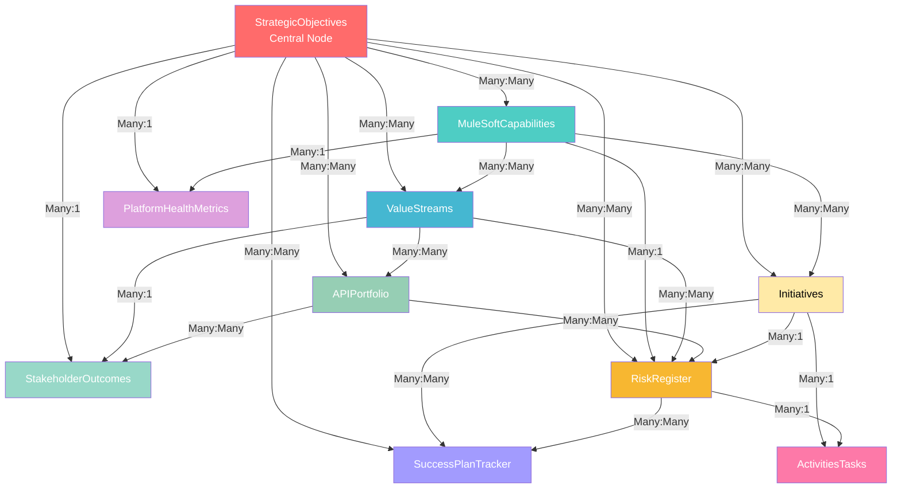
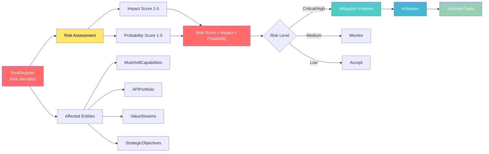
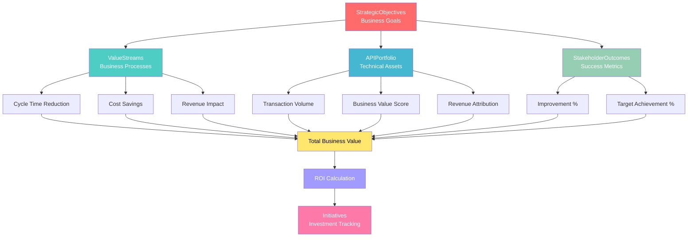
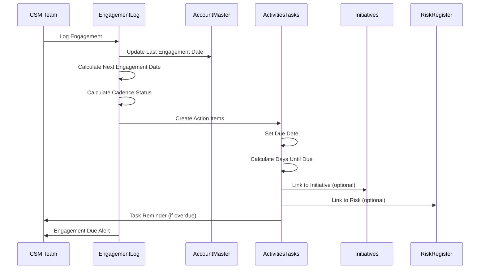
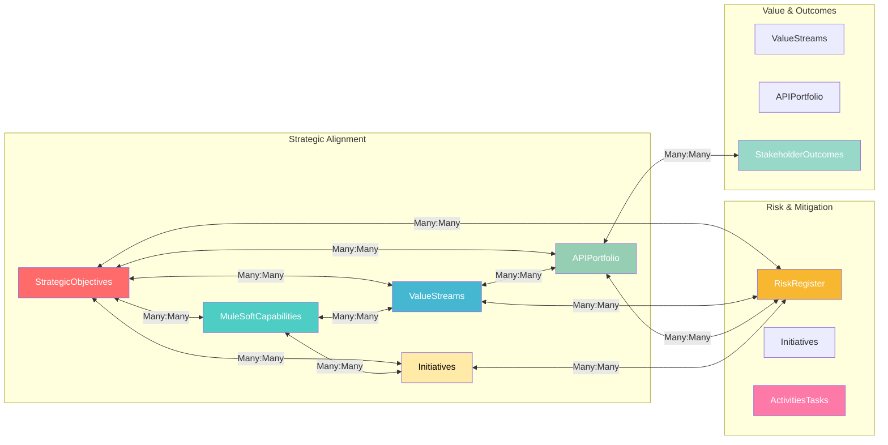

# Architecture Diagrams: MuleSoft CSM Intelligence Platform
## Visual Representations for FigJam Import

---

## Diagram 1: Complete Table Relationship Map

---

## Diagram 2: Data Flow - Health Score Calculation

---

## Diagram 3: Strategic Alignment Network

---

## Diagram 4: Risk Mitigation Chain

---

## Diagram 5: Value Realization Flow

---

## Diagram 6: Engagement & Task Management Flow

---

## Diagram 7: Account Hierarchy View

```mermaid
graph TD
    AM[AccountMaster<br/>Central Hub] --> BC[BusinessContext<br/>1:1]
    
    AM --> SO[StrategicObjectives<br/>1:Many]
    AM --> MC[MuleSoftCapabilities<br/>1:Many]
    AM --> VS[ValueStreams<br/>1:Many]
    AM --> API[APIPortfolio<br/>1:Many]
    AM --> PHM[PlatformHealthMetrics<br/>1:Many]
    AM --> INIT[Initiatives<br/>1:Many]
    AM --> RISK[RiskRegister<br/>1:Many]
    AM --> OUT[StakeholderOutcomes<br/>1:Many]
    AM --> ENG[EngagementLog<br/>1:Many]
    AM --> SPT[SuccessPlanTracker<br/>1:Many]
    AM --> TASK[ActivitiesTasks<br/>1:Many]
    
    style AM fill:#ff6b6b,color:#fff,stroke:#000,stroke-width:4px
    style BC fill:#4ecdc4,color:#fff
    style SO fill:#45b7d1,color:#fff
    style MC fill:#96ceb4,color:#fff
    style VS fill:#ffeaa7,color:#000
    style API fill:#dda0dd,color:#fff
    style PHM fill:#98d8c8,color:#fff
    style INIT fill:#f7b731,color:#fff
    style RISK fill:#fd79a8,color:#fff
    style OUT fill:#a29bfe,color:#fff
    style ENG fill:#6c5ce7,color:#fff
    style SPT fill:#00b894,color:#fff
    style TASK fill:#e17055,color:#fff
```

---

## Diagram 8: Cross-Table Many:Many Relationships

---

## How to Use These Diagrams

### Option 1: Mermaid Live Editor
1. Copy any diagram code block
2. Go to https://mermaid.live
3. Paste the code
4. Export as PNG, SVG, or PDF

### Option 2: FigJam Import
1. Use Mermaid Live Editor to generate SVG
2. Import SVG into FigJam
3. Enhance with FigJam's visual tools

### Option 3: Documentation
- These diagrams render automatically in:
  - GitHub README files
  - GitLab documentation
  - Many markdown viewers
  - VS Code with Mermaid extension

### Option 4: Presentation Tools
- Export as images and use in:
  - PowerPoint
  - Google Slides
  - Confluence
  - Notion

---

## Diagram Legend

### Relationship Types
- `||--||` = One-to-One (1:1)
- `||--o{` = One-to-Many (1:Many)
- `}o--o{` = Many-to-Many (Many:Many)
- `||--o{` = Many-to-One (Many:1)

### Colors
- **Red (#ff6b6b)**: Central/Important nodes
- **Teal (#4ecdc4)**: Capabilities
- **Blue (#45b7d1)**: Value Streams
- **Green (#96ceb4)**: APIs/Technical
- **Yellow (#ffeaa7)**: Initiatives
- **Purple (#a29bfe)**: Plans/Tracking
- **Pink (#fd79a8)**: Tasks/Actions
- **Orange (#f7b731)**: Risks

---

**Last Updated:** 2024-11-09
**Version:** 1.0

